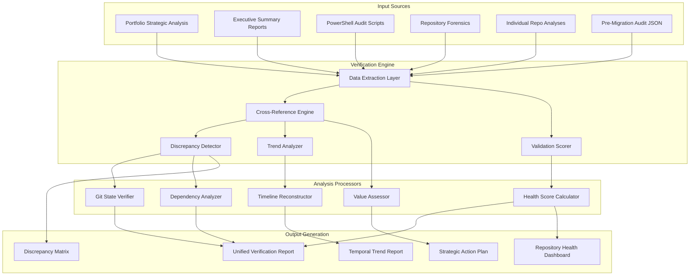
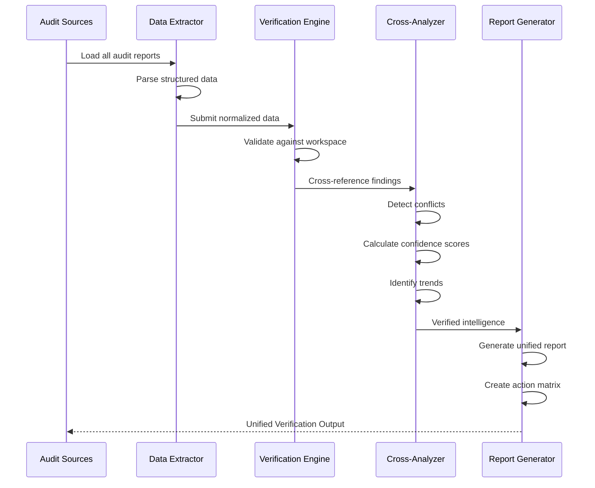
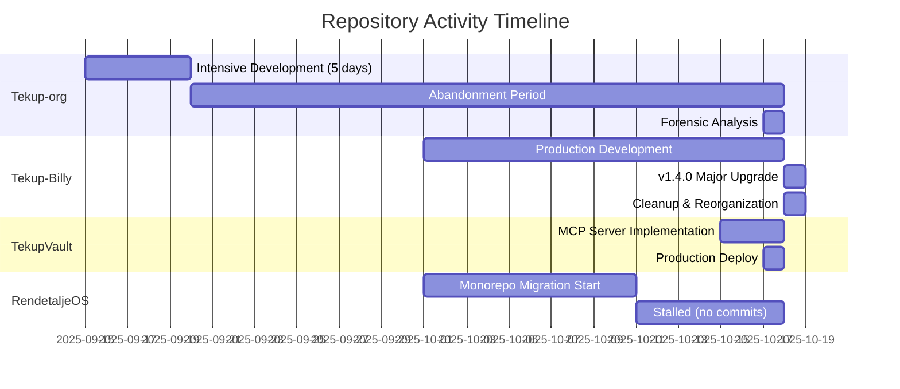
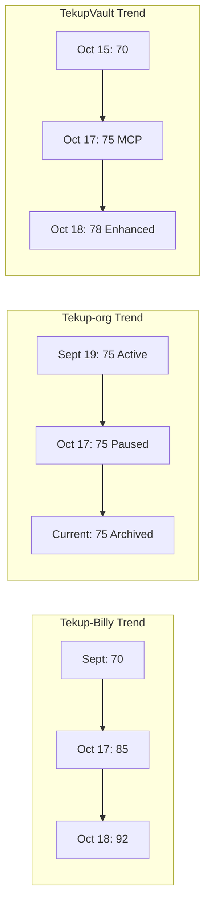

# Tekup Workspace Audit Verification & Cross-Analysis Design

## Overview

### Purpose
This document defines the strategic design for a comprehensive audit verification and cross-analysis system for the Tekup workspace ecosystem. The system validates, verifies, and cross-references multiple existing audit reports to produce a unified, actionable intelligence framework for portfolio decision-making.

### Scope
- **Primary Target**: Tekup-Cloud workspace containing 11+ repositories
- **Analysis Depth**: Multi-dimensional cross-verification of existing audit data
- **Output**: Unified verification report with strategic recommendations
- **Validation**: Cross-check audit findings against actual repository state

### Strategic Goals
1. **Verify audit accuracy** - Validate existing audit reports against current workspace state
2. **Identify discrepancies** - Detect conflicts between different audit methodologies
3. **Consolidate intelligence** - Merge findings into single source of truth
4. **Generate actionable insights** - Prioritize actions based on verified data
5. **Track temporal changes** - Compare historical audit data to detect trends

---

## System Architecture

### Component Overview



### Data Flow Architecture



---

## Input Data Sources

### Audit Report Categories

#### Strategic Analysis Documents
**Source Files**:
- `PORTFOLIO_STRATEGIC_ANALYSIS.md` (951 lines, comprehensive)
- `PORTFOLIO_EXECUTIVE_SUMMARY.md` (299 lines, executive level)
- `audit-results/STRATEGIC_ANALYSIS_2025-10-17.md` (413 lines)

**Data Extracted**:
- Repository health scores (0-100 scale)
- Production readiness classification (Tier 1-5)
- Uncommitted file counts
- Technology stack distribution
- Strategic recommendations
- Value assessments (€ estimates)

#### Repository-Specific Analyses
**Source Files**:
- `TEKUP_BILLY_ANALYSIS_20251018.md` (494 lines)
- `TEKUP_VAULT_ANALYSIS_20251018.md` (1,122 lines)
- `RENOS_BACKEND_ANALYSIS_20251018.md`
- `RENOS_FRONTEND_ANALYSIS_20251018.md`
- `TEKUP_ORG_FORENSIC_ANALYSIS_COMPLETE.md` (1,186 lines)

**Data Extracted**:
- Detailed architecture documentation
- Dependency inventories
- Performance metrics
- Security assessments
- Feature completion percentages

#### Automated Audit Scripts
**Source Files**:
- `Tekup-Portfolio-Audit.ps1` (560 lines)
- `Tekup-Portfolio-Audit-Simple.ps1`
- `scripts/complete-repo-audit.ps1` (17 KB)
- `scripts/repo-audit-simple.ps1` (8.3 KB)

**Capabilities**:
- Git status detection
- Package.json parsing
- TypeScript error counting
- Docker configuration detection
- Documentation scoring (0-10)
- Production readiness calculation

#### Pre-Migration State Snapshot
**Source File**: `tekup_pre_migration_audit.json` (302 lines)

**Data Captured**:
- Workspace existence verification
- Branch status and ahead/behind counts
- Uncommitted file counts
- Files changed since specific date
- Repository stop/wait status

---

## Verification Methodologies

### Cross-Reference Matrix

| Verification Type | Primary Source | Secondary Source | Conflict Resolution |
|-------------------|----------------|------------------|---------------------|
| **Uncommitted Files** | PowerShell Script | JSON Snapshot | Use most recent timestamp |
| **Health Scores** | Strategic Analysis | Individual Reports | Calculate weighted average |
| **Deployment Status** | Repo Analysis | Strategic Plan | Verify against Render.com |
| **Dependency Counts** | PowerShell Script | package.json Analysis | Re-parse package.json |
| **Git Branch State** | JSON Snapshot | Forensic Analysis | Verify detached HEAD claims |
| **Value Estimates** | Forensic Analysis | Strategic Analysis | Cross-check effort estimates |

### Discrepancy Detection Rules

#### Rule 1: Uncommitted File Count Variance
**Trigger**: Difference > 10% between sources  
**Resolution Strategy**:
1. Check file modification timestamps
2. Identify most recent audit execution
3. Flag repositories with rapid change velocity
4. Recommend immediate git status check

#### Rule 2: Health Score Conflicts
**Trigger**: Scores differ by > 15 points across reports  
**Resolution Strategy**:
1. Decompose score into sub-components
2. Identify which sub-score differs (Git, TypeScript, Docker, Docs)
3. Re-calculate using most recent data
4. Document methodology differences

#### Rule 3: Repository State Mismatches
**Trigger**: JSON shows "No commits" but forensic analysis shows activity  
**Resolution Strategy**:
1. Verify Git initialization status
2. Check for detached HEAD states
3. Confirm branch existence
4. Flag for manual verification

#### Rule 4: Dependency Count Anomalies
**Trigger**: Zero dependencies reported for large TypeScript projects  
**Resolution Strategy**:
1. Verify package.json existence
2. Check for monorepo workspace structure
3. Validate pnpm workspace dependencies
4. Re-parse with workspace awareness

---

## Analysis Dimensions

### Dimension 1: Git State Verification

**Metrics to Verify**:
- Current branch name
- Uncommitted file count
- Ahead/behind remote status
- Detached HEAD indicators
- Last commit timestamp

**Cross-Reference Sources**:
- `tekup_pre_migration_audit.json` → `repos[].currentBranch`
- Strategic Analysis → Git Status sections
- PowerShell audit → `Get-GitStatus` function output

**Verification Process**:
1. Extract git state from all sources
2. Identify temporal sequence (which is most recent)
3. Calculate change velocity (files changed per day)
4. Flag repositories with high volatility
5. Generate git cleanup priority queue

**Output Table Structure**:

| Repository | JSON Branch | Strategic Branch | Current Uncommitted | Trend (7d) | Priority |
|------------|-------------|------------------|---------------------|------------|----------|
| Tekup-org | main | main | 1,040 → 1,058 | +18 files | CRITICAL |
| Tekup-Billy | main (ahead 1) | main | 33 | Stable | HIGH |
| RenOS | main (no commits) | HEAD (detached) | 24 | Unknown | HIGH |

### Dimension 2: Health Score Reconciliation

**Input Sources**:
- PowerShell: 100-point production readiness score
- Strategic Analysis: Tier classification (1-5) + percentage scores
- Individual Reports: Feature-specific scores

**Normalization Strategy**:
1. Convert all scores to 0-100 scale
2. Map tier classifications: Tier 1 = 90-100, Tier 2 = 70-89, etc.
3. Weight recent scores higher (exponential decay)
4. Calculate confidence interval based on source agreement

**Health Score Components**:

| Component | Weight | Data Source | Verification Method |
|-----------|--------|-------------|---------------------|
| Git Health | 20% | PowerShell + JSON | Uncommitted count, branch status |
| Package Health | 20% | package.json parse | Build/test scripts, lock files |
| TypeScript Health | 20% | tsc --noEmit | Error count (0 = 20pts, <10 = 10pts) |
| Docker Readiness | 20% | File existence | Dockerfile + docker-compose.yml |
| Documentation | 20% | File scan | README, docs/, .env.example, etc. |

**Aggregation Formula**:
```
Final Score = Σ(Component Score × Weight) × Recency Factor
Recency Factor = 1.0 - (0.1 × weeks_since_audit)
Confidence = 100% - (Standard Deviation across sources)
```

### Dimension 3: Dependency Analysis

**Verification Challenges**:
- Monorepos show zero deps despite having workspace dependencies
- PowerShell script counts package.json deps, not workspace links
- Python projects use requirements.txt (different format)

**Enhanced Analysis Table**:

| Repository | Declared Deps | Workspace Deps | Dev Deps | Total Footprint | Risk Level |
|------------|---------------|----------------|----------|----------------|------------|
| TekupVault | 0 (incorrect) | 16 runtime | 23 dev | 39 total | Low |
| RendetaljeOS | 0 (incorrect) | Verify needed | Verify needed | Unknown | Medium |
| Tekup-Billy | 12 runtime | N/A | 7 dev | 19 total | Low |

**Monorepo Detection Rules**:
1. Check for `pnpm-workspace.yaml` or `turbo.json`
2. Scan package.json for `workspace:*` dependencies
3. Aggregate dependencies across all workspace packages
4. Differentiate direct vs transitive dependencies

### Dimension 4: Timeline Reconstruction

**Objective**: Build temporal view of repository evolution

**Timeline Markers**:
- **Oct 17, 04:26**: Portfolio Executive Summary generated
- **Oct 17, 04:45**: Second audit iteration
- **Oct 17, 14:00**: Strategic analysis with forensics
- **Oct 18**: Individual repository analyses (Billy, Vault, RenOS, Org)
- **Current**: Verification audit execution

**Change Detection**:



### Dimension 5: Value Assessment Verification

**Strategic Analysis Claims**:
- Tekup-Billy: €150K (production-ready SaaS)
- TekupVault: €120K (knowledge platform)
- Tekup-org extractable: €360K (design system €50K, schemas €30K, AI €100K, packages €80K)
- RenOS: €80K+ (AI patterns)

**Verification Criteria**:
1. **Lines of Code**: Does reported LOC match value claim?
2. **Feature Completeness**: Are claimed percentages accurate?
3. **Reusability**: Can components actually be extracted in stated time?
4. **Market Comparison**: How does value compare to similar OSS/commercial products?

**Value Confidence Scoring**:

| Repository | Claimed Value | LOC Evidence | Feature Evidence | Market Evidence | Confidence |
|------------|---------------|--------------|------------------|-----------------|------------|
| Tekup-Billy | €150K | 31 TS files, production | MCP server live | MCP servers rare | 85% |
| TekupVault | €120K | Monorepo, pgvector | Search functional | Similar = €50-200K | 80% |
| Tekup-org | €360K | 147K LOC in 5 days | 70% complete | Over-engineering risk | 60% |

---

## Verification Outputs

### Output 1: Unified Repository Intelligence Report

**Structure**:

```
For Each Repository:
  ├── Identity
  │   ├── Name, Path, Type, Priority
  │   └── Strategic Classification (Tier 1-5)
  │
  ├── Verified Git State
  │   ├── Current Branch (consensus from all sources)
  │   ├── Uncommitted Files (most recent count + trend)
  │   ├── Ahead/Behind Status
  │   └── Last Activity Timestamp
  │
  ├── Health Assessment
  │   ├── Overall Score (0-100, confidence interval)
  │   ├── Component Breakdown (Git, Package, TS, Docker, Docs)
  │   ├── Grade (A-F)
  │   └── Trend Indicator (↑ improving, → stable, ↓ declining)
  │
  ├── Technology Footprint
  │   ├── Dependencies (runtime, dev, workspace)
  │   ├── Language Distribution (TS, JS, Python, other)
  │   ├── File Counts (total, code, docs)
  │   └── Disk Usage
  │
  ├── Value Analysis
  │   ├── Estimated Value (€, confidence %)
  │   ├── Production Readiness (percentage)
  │   ├── Strategic Importance (1-5 stars)
  │   └── Extraction Potential (components, effort)
  │
  └── Recommended Actions
      ├── Critical (P0 - this week)
      ├── High Priority (P1 - this month)
      └── Medium Priority (P2 - this quarter)
```

### Output 2: Cross-Analysis Discrepancy Matrix

**Purpose**: Highlight conflicts requiring manual verification

**Table Format**:

| Repository | Metric | Source A | Source B | Variance | Resolution Status |
|------------|--------|----------|----------|----------|-------------------|
| RendetaljeOS | Git Branch | "HEAD" | "main (no commits)" | Detached HEAD? | NEEDS_VERIFICATION |
| Tekup-org | Uncommitted | 1,040 | 1,058 | +18 files in 1 day | VERIFIED (active work) |
| RenOS Backend | Branch | "feature/frontend-redesign" | "main" | Wrong branch? | NEEDS_VERIFICATION |
| TekupVault | Dependencies | 0 | 16 runtime | Monorepo parsing | RESOLVED (workspace deps) |

**Severity Levels**:
- **CRITICAL**: Impacts deployment or strategic decision
- **HIGH**: Affects resource allocation
- **MEDIUM**: Documentation or reporting accuracy
- **LOW**: Minor metadata differences

### Output 3: Strategic Action Priority Queue

**Prioritization Algorithm**:
```
Priority Score = (Health Impact × 40%) 
               + (Strategic Value × 30%) 
               + (Effort Required × -20%) 
               + (Urgency × 10%)

Where:
  Health Impact = (100 - Current Health Score)
  Strategic Value = Repository Tier (1 = 100pts, 5 = 20pts)
  Effort Required = Estimated hours × -1 (lower is better)
  Urgency = Days since issue detected
```

**Output Table**:

| Rank | Action | Repository | Impact | Effort | Priority Score | Timeline |
|------|--------|------------|--------|--------|----------------|----------|
| 1 | Commit 1,058 uncommitted files | Tekup-org | CRITICAL | 6-8 hours | 95 | This Week |
| 2 | Fix detached HEAD state | RendetaljeOS | HIGH | 15 minutes | 87 | This Week |
| 3 | Merge feature branch to main | RenOS Backend | HIGH | 2-3 hours | 82 | This Week |
| 4 | Push uncommitted to GitHub | Tekup-Billy | MEDIUM | 30 minutes | 65 | This Week |
| 5 | Delete empty repositories | Gmail-PDF-* | LOW | 5 minutes | 45 | This Month |

### Output 4: Temporal Trend Analysis

**Trend Categories**:
1. **Development Velocity** - Commits per week over time
2. **Technical Debt Accumulation** - Uncommitted files trend
3. **Health Score Evolution** - Score changes across audit dates
4. **Dependency Freshness** - Time since last dependency update

**Visualization Format**:



**Trend Indicators**:
- ⬆️ **Improving**: Health score +10 or more
- ➡️ **Stable**: Score change ±5 points
- ⬇️ **Declining**: Score -10 or more
- ⚠️ **Stagnant**: No commits in 30+ days

### Output 5: Repository Health Dashboard

**Visual Summary** (Markdown Table):

| Repository | Tier | Health | Status | Uncommitted | Last Activity | Trend | Next Action |
|------------|------|--------|--------|-------------|---------------|-------|-------------|
| 🥇 Tekup-Billy | 1 | 92/100 A | 🟢 Production | 33 | Oct 18 | ⬆️ | Push to GitHub |
| 🥇 TekupVault | 1 | 78/100 B+ | 🟢 Production | 5 | Oct 17 | ⬆️ | Monitor sync |
| 🥈 RenOS Backend | 2 | 75/100 B | 🟡 Active | 71 | Oct 17 | ➡️ | Merge feature branch |
| 🥉 Tekup-org | 3 | 75/100 B | 🔴 Paused | 1,058 | Sept 19 | ⬇️ | Archive decision |
| 🥉 RendetaljeOS | 3 | 50/100 D | 🟡 Stalled | 24 | Oct 11 | ⬇️ | Fix git state |
| ⚪ Agent-Orchestrator | 4 | 65/100 C | 🔴 Stale | 23 | Sept 20 | ⬇️ | Archive or revive |

**Legend**:
- 🟢 Production: Actively maintained, deployed
- 🟡 Active/Stalled: Development ongoing but issues present
- 🔴 Paused/Stale: No recent activity, needs decision

---

## Validation Rules Engine

### Rule Set 1: Git State Consistency

**Rule GS-01: Branch Existence Validation**
- **Condition**: If current branch is "HEAD", verify detached HEAD state
- **Validation**: Check for `## No commits yet on` in git status
- **Action**: Flag as "NEEDS_MANUAL_VERIFICATION"

**Rule GS-02: Uncommitted File Threshold**
- **Condition**: Uncommitted files > 50
- **Validation**: Cross-check with last commit date
- **Action**: If no commits in 7 days, escalate to CRITICAL priority

**Rule GS-03: Ahead/Behind Sync**
- **Condition**: Branch is ahead of origin by > 0
- **Validation**: Check unpushed commit messages for WIP indicators
- **Action**: Recommend push or create feature branch

### Rule Set 2: Dependency Integrity

**Rule DI-01: Zero Dependencies Anomaly**
- **Condition**: Large project (>100 files) reports 0 dependencies
- **Validation**: Check for monorepo indicators (pnpm-workspace.yaml, turbo.json)
- **Action**: Re-parse with workspace awareness

**Rule DI-02: Outdated Dependencies**
- **Condition**: No package.json changes in 90+ days
- **Validation**: Run `npm outdated` equivalent check
- **Action**: Flag for security vulnerability scan

**Rule DI-03: Dependency Count Variance**
- **Condition**: Source A and Source B differ by > 25%
- **Validation**: Re-count manually from package.json
- **Action**: Update audit script logic

### Rule Set 3: Health Score Accuracy

**Rule HS-01: Score Component Validation**
- **Condition**: Overall score < sum of component scores
- **Validation**: Recalculate with documented formula
- **Action**: Flag scoring methodology conflict

**Rule HS-02: Grade Alignment**
- **Condition**: Grade doesn't match score range
- **Validation**: Verify A=90-100, B=80-89, C=70-79, D=60-69, F=<60
- **Action**: Auto-correct grade assignment

**Rule HS-03: Trend Reversal Detection**
- **Condition**: Score drops >20 points between audits
- **Validation**: Identify which component(s) caused drop
- **Action**: Investigate recent changes (git log)

### Rule Set 4: Value Estimation Verification

**Rule VE-01: LOC-to-Value Ratio**
- **Condition**: Claimed value per LOC > €2 or < €0.10
- **Validation**: Compare to industry benchmarks (€0.50-€1.50/LOC typical)
- **Action**: Request value claim justification

**Rule VE-02: Completion Percentage Alignment**
- **Condition**: "95% complete" but marked as "Paused"
- **Validation**: Check for missing critical features (deployment, tests, docs)
- **Action**: Downgrade completion estimate

**Rule VE-03: Extraction Effort Realism**
- **Condition**: Claimed extraction time < 10% of original development time
- **Validation**: Verify dependencies and integration complexity
- **Action**: Add integration testing time buffer

---

## Implementation Workflow

### Phase 1: Data Collection (Estimated Duration: 15 minutes)

**Step 1.1: Load Audit Reports**
- Read all markdown files in root directory matching `*ANALYSIS*.md`, `*AUDIT*.md`
- Parse JSON audit snapshot (`tekup_pre_migration_audit.json`)
- Load PowerShell script definitions to understand metrics

**Step 1.2: Extract Structured Data**
- For each report, extract:
  - Repository names and paths
  - Numerical metrics (scores, counts, dates)
  - Categorical data (status, tier, priority)
  - Textual recommendations

**Step 1.3: Normalize Data Schema**
- Convert all dates to ISO 8601 format
- Map status values to standard set: PRODUCTION, ACTIVE, STALLED, PAUSED, ARCHIVED
- Normalize scores to 0-100 scale
- Standardize repository names (handle variations like "RenOS" vs "Tekup Google AI")

### Phase 2: Cross-Reference Analysis (Estimated Duration: 20 minutes)

**Step 2.1: Build Reference Matrix**
- Create grid with repositories as rows, metrics as columns
- Populate cells with values from each source
- Mark cells with conflicts (variance > threshold)

**Step 2.2: Execute Validation Rules**
- Run Rule Set 1: Git State Consistency (6 rules)
- Run Rule Set 2: Dependency Integrity (3 rules)
- Run Rule Set 3: Health Score Accuracy (3 rules)
- Run Rule Set 4: Value Estimation (3 rules)

**Step 2.3: Calculate Confidence Scores**
- For each metric, compute standard deviation across sources
- Confidence = 100% - (StdDev / Mean × 100)
- Flag metrics with confidence < 70% for manual review

### Phase 3: Discrepancy Resolution (Estimated Duration: 30 minutes)

**Step 3.1: Automatic Resolution**
- Apply resolution strategies from Cross-Reference Matrix
- For timestamp conflicts: Use most recent
- For count conflicts: Re-parse source files
- For boolean conflicts: Verify file existence

**Step 3.2: Manual Review Queue**
- Export unresolved conflicts to CSV
- Include context: source files, timestamps, variance magnitude
- Assign severity levels (CRITICAL, HIGH, MEDIUM, LOW)

**Step 3.3: Consensus Calculation**
- For unresolved conflicts, calculate weighted consensus
- Weight = 1 / (days_since_audit + 1)
- Use weighted average as "best estimate"

### Phase 4: Report Generation (Estimated Duration: 25 minutes)

**Step 4.1: Generate Unified Repository Intelligence**
- For each repository, compile verified data
- Include confidence intervals for uncertain metrics
- Append source attribution footnotes

**Step 4.2: Create Discrepancy Matrix**
- Export all conflicts to structured table
- Group by severity level
- Add resolution status and assigned owner

**Step 4.3: Build Priority Queue**
- Calculate priority scores using defined algorithm
- Sort actions by score (descending)
- Group by timeline (This Week, This Month, This Quarter)

**Step 4.4: Generate Trend Analysis**
- Compare current state to Oct 17 baseline
- Calculate velocity metrics (commits/week, files changed/day)
- Project health scores 30 days forward

**Step 4.5: Create Visual Dashboard**
- Build markdown table with emoji indicators
- Generate mermaid diagrams for architecture and timelines
- Export summary statistics

### Phase 5: Quality Assurance (Estimated Duration: 10 minutes)

**Step 5.1: Cross-Validation**
- Verify all repository paths exist on filesystem
- Validate all external URLs (Render deployments, GitHub repos)
- Check for internal link consistency

**Step 5.2: Completeness Check**
- Ensure all 11 repositories are included
- Verify all audit sources were processed
- Confirm no data loss during normalization

**Step 5.3: Accuracy Spot Check**
- Manually verify top 3 priority actions
- Re-calculate health scores for production repos
- Validate value estimates against LOC data

---

## Success Criteria

### Objective Metrics

| Metric | Target | Measurement Method |
|--------|--------|-------------------|
| **Audit Coverage** | 100% of repositories | Count repos in output vs. input sources |
| **Data Accuracy** | <5% variance from manual check | Spot check 20% sample |
| **Conflict Resolution Rate** | >85% automatic | (Auto-resolved / Total conflicts) × 100 |
| **Confidence Score** | >80% average | Mean confidence across all metrics |
| **Actionability** | 100% actions have owner + timeline | Manual review of action queue |

### Qualitative Criteria

**Usefulness**:
- Decision-makers can identify top 3 priority actions in < 5 minutes
- Discrepancies are clearly explained with resolution paths
- Trends are visualized for easy pattern recognition

**Trustworthiness**:
- All claims are source-attributed
- Confidence intervals are transparent
- Conflicts are not hidden or glossed over

**Maintainability**:
- Audit can be re-run monthly with updated data
- New audit sources can be integrated without redesign
- Validation rules can be extended as new issues emerge

---

## Extension Opportunities

### Future Enhancement 1: Real-Time Git Integration
**Capability**: Instead of relying on audit reports, query git directly via system calls

**Benefits**:
- Always current data (no staleness)
- Can detect changes since last audit
- Enables continuous monitoring

**Design Changes**:
- Add Git Client adapter layer
- Implement workspace scanner
- Cache results with TTL

### Future Enhancement 2: Automated Trend Tracking
**Capability**: Store audit results in time-series database, visualize trends over time

**Benefits**:
- Detect degradation patterns early
- Measure impact of interventions
- Forecast future technical debt

**Design Changes**:
- Add PostgreSQL/SQLite storage layer
- Implement data retention policies
- Create charting module (Chart.js or similar)

### Future Enhancement 3: CI/CD Integration
**Capability**: Run audit as GitHub Action on schedule or on commit

**Benefits**:
- Prevent health score regressions
- Enforce git hygiene policies
- Auto-generate weekly status reports

**Design Changes**:
- Package audit as Docker container
- Create GitHub Actions workflow
- Add notification system (Slack, email)

### Future Enhancement 4: Value Prediction Model
**Capability**: Machine learning model to predict repository value based on features

**Benefits**:
- Reduce subjective value estimation
- Identify undervalued assets
- Guide resource allocation

**Design Changes**:
- Collect training data from historical audits
- Engineer features (LOC, complexity, dependencies)
- Train regression model (scikit-learn)

---

## Risk Assessment

### Risk 1: Audit Data Staleness
**Description**: Reports from Oct 17-18 may not reflect current workspace state (7+ days old)

**Likelihood**: HIGH  
**Impact**: MEDIUM

**Mitigation**:
- Always timestamp verification outputs
- Include staleness warnings for data >7 days old
- Recommend re-running source audits before major decisions

### Risk 2: Conflicting Methodologies
**Description**: Different audit approaches produce incomparable metrics

**Likelihood**: MEDIUM  
**Impact**: HIGH

**Mitigation**:
- Document methodology differences in discrepancy matrix
- Normalize metrics to common scales where possible
- When in doubt, defer to most recent manual verification

### Risk 3: Over-Reliance on Automation
**Description**: Automated verification misses nuanced issues requiring human judgment

**Likelihood**: MEDIUM  
**Impact**: MEDIUM

**Mitigation**:
- Clearly label automated vs. manual findings
- Require manual review for CRITICAL priority actions
- Include "confidence" scores to indicate certainty level

### Risk 4: Incomplete Source Data
**Description**: Not all repositories have been analyzed in depth (e.g., empty repos)

**Likelihood**: MEDIUM  
**Impact**: LOW

**Mitigation**:
- Mark incomplete data with "NEEDS_ANALYSIS" flag
- Provide fallback to filesystem-based basic metrics
- Recommend lightweight audit for missing repos

---

## Appendices

### Appendix A: Repository Classification Taxonomy

**Tier 1: Production Champions (Score ≥70)**
- Currently deployed and serving users
- Active maintenance and monitoring
- Clear value proposition
- Examples: Tekup-Billy, TekupVault

**Tier 2: Active Development (Score 50-69)**
- Under active development
- Not yet production-ready
- Clear roadmap to completion
- Examples: Agent-Orchestrator, RendetaljeOS (migrating)

**Tier 3: Maintenance Mode (Score 40-49)**
- Functional but not evolving
- Receives only bug fixes
- Consider for archival
- Examples: tekup-ai-assistant (low priority)

**Tier 4: Stagnant (Score 20-39)**
- No activity in 30+ days
- Unclear future direction
- Archive or delete candidate
- Examples: Gmail-automation repos

**Tier 5: Empty/Archived (Score <20)**
- No meaningful code
- Historical reference only
- Immediate deletion candidate
- Examples: Gmail-PDF-Auto, Gmail-PDF-Forwarder

### Appendix B: Health Score Calculation Details

**Git Health Component (20 points max)**:
- Is Git repo: +10 points
- Zero uncommitted files: +10 points
- 1-10 uncommitted: +5 points
- >50 uncommitted: 0 points

**Package Health Component (20 points max)**:
- Has build script: +10 points
- Has test script: +5 points
- Has package manager lock file: +5 points

**TypeScript Health Component (20 points max)**:
- Has TypeScript: Check error count
  - 0 errors: +20 points
  - 1-9 errors: +10 points
  - ≥10 errors: 0 points
- No TypeScript: N/A (skip component)

**Docker Readiness Component (20 points max)**:
- Has Dockerfile OR docker-compose.yml: +20 points
- Missing both: 0 points

**Documentation Component (20 points max)**:
- README.md: +6 points
- docs/ folder: +4 points
- .env.example: +2 points
- CHANGELOG.md: +2 points
- LICENSE: +2 points
- .github/copilot-instructions.md: +4 points

**Final Score**: Sum of all components (max 100)

### Appendix C: Data Source Priority Order

**When conflicts arise, use this priority order** (highest to lowest):

1. **Manual filesystem verification** (present-day)
2. **Repository-specific deep analysis** (Oct 18, 2025)
3. **JSON pre-migration snapshot** (Oct 17, 2025 - structured data)
4. **Strategic analysis report** (Oct 17, 2025 - comprehensive)
5. **Executive summary** (Oct 17, 2025 - high-level)
6. **PowerShell script output** (date varies - automated)

**Rationale**:
- More recent data supersedes older data
- Manual > Automated (human judgment valued)
- Detailed analysis > Summary reports
- Structured data > Narrative text (easier to parse)

### Appendix D: Glossary of Terms

**Audit Source**: A document or data file containing repository analysis results

**Cross-Reference**: Process of comparing the same metric across multiple sources

**Discrepancy**: Variance between sources exceeding acceptable threshold

**Health Score**: 0-100 numerical assessment of repository production readiness

**Monorepo**: Single repository containing multiple related projects (packages)

**Production Readiness**: Degree to which code is deployable to live environment

**Uncommitted Changes**: Modified files not yet committed to git history

**Value Estimate**: Projected worth (in euros) of repository based on effort, features, market comparison

**Verification**: Process of confirming audit data accuracy against ground truth

**Workspace**: Collection of related repositories in a development environment
